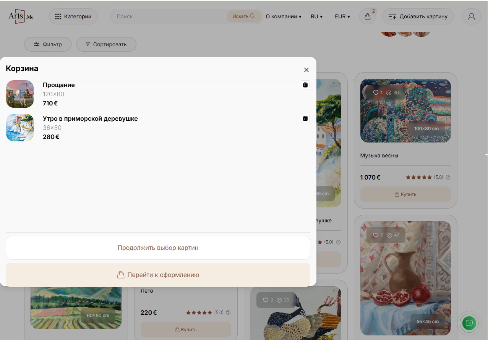
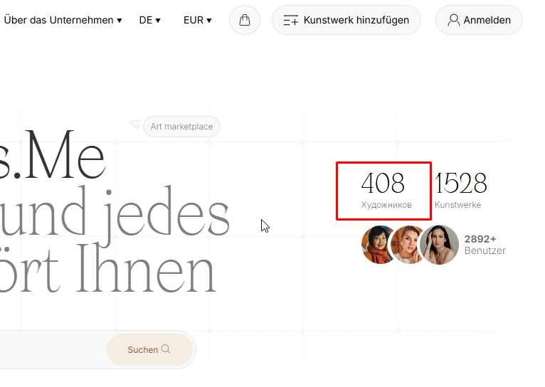
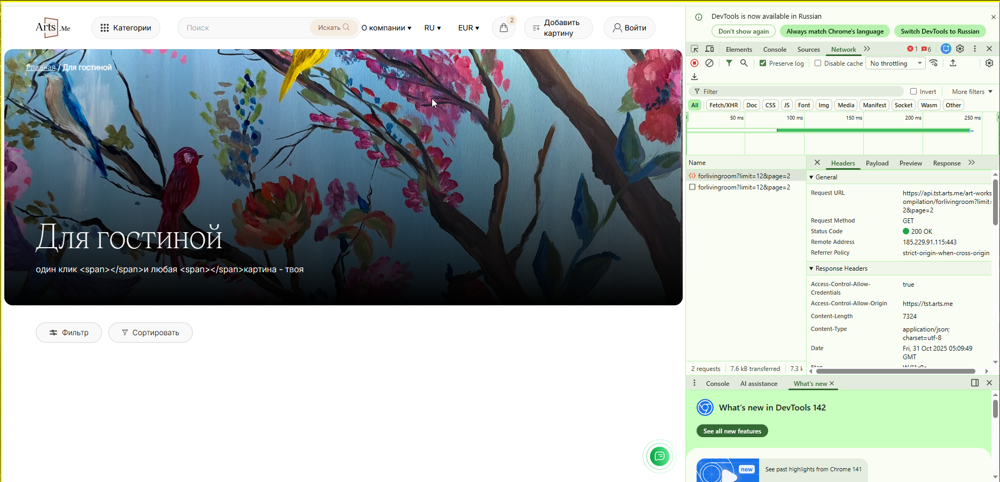
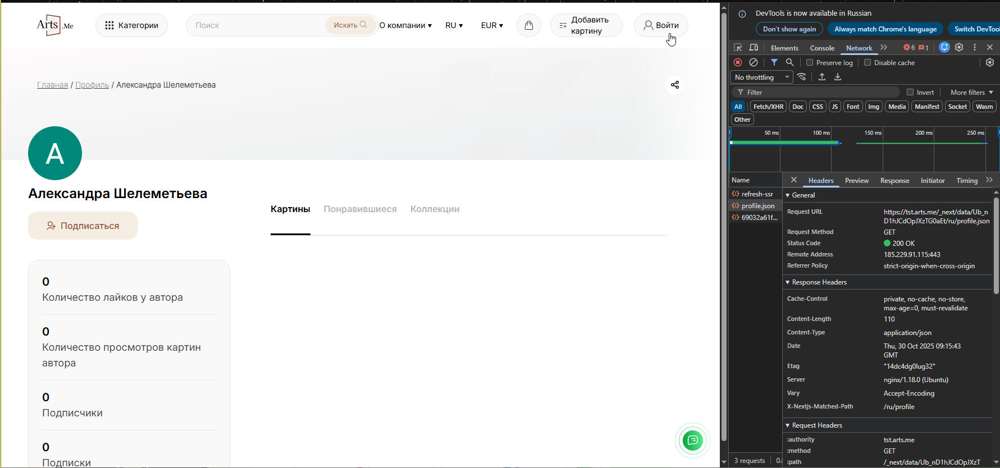
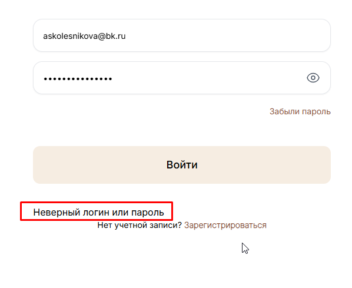

# Кейс 1
## Шаги воспроизведения
1. Перейти на главную страницу https://tst.arts.me/  
2. в поисковую строку ввести запрос (в шапке профиля или на самой странице)
3. нажать Enter 
4. вернутся в поисковую строку, внести изменения в запрос или написать новый
5. нажать Enter
**Ожидаемый результат:**  выпадающее окно с подсказками пропадет, отобразятся результаты поиска
**Фактический результат:**  выпадающее окно с подсказками остается, отображаются результаты поиска
[Видео, артефакт проверки](https://drive.google.com/file/d/1NPsJdBAGdamcDk6EudPIbtfn9qhWakj6/view?usp=sharing) 

# Кейс 2
## Шаги воспроизведения
1. Перейти на главную страницу https://tst.arts.me/ 
2. нажать на кнопку Фильтры
3. выбрать любое количество фильтров
4. нажать кнопку Применить
5. нажать на кнопку Фильтры
6. нажать кнопку Сбросить
7. нажать на кнопку Фильтры
**Ожидаемый результат:** все чекбоксы выбранные ранее не будут отображаться
**Фактический результат:** ранее выбранные чекбоксы продолжают отображаться
[Видео, артефакт проверки](https://drive.google.com/file/d/1qxAEe__3oiNLOSmny-sb9tuNV9-yubxT/view?usp=sharing) 

# Кейс 3
## Шаги воспроизведения
1. Перейти на главную страницу https://tst.arts.me/ 
2. добавить товар в корзину
3. уменьшить ширину окна браузера до 1279рх или менее
**Ожидаемый результат:** всплывающее окно с отображением товаров в корзине отображается корректно по центру, элементы в нем также отцентрованы
**Фактический результат:**  всплывающее окно прилипло к краю окна, элементы внутри окна также смещены
  

# Кейс 4
## Шаги воспроизведения
1. Перейти на главную страницу https://tst.arts.me/ 
2. изменить язык на Немецкий
**Ожидаемый результат:** весь текст на странице будет локализован
**Фактический результат:**  не переведено слово Художников
 

# Кейс 5
## Шаги воспроизведения
1. Перейти на главную страницу https://tst.arts.me/ 
2. изменить валюту на CHF (швейцарский франк)
**Ожидаемый результат:** под товарами корректное указание суммы и валюты
**Фактический результат:**  страница падает
[Видео, артефакт проверки](https://drive.google.com/file/d/1FwlAQzVedpA8OQ4u0OsTxi9dLSOtleUF/view?usp=sharing) 

# Кейс 6
## Шаги воспроизведения
1. Перейти на главную страницу https://tst.arts.me/ 
2. нажать кнопку Категории
3. выбрать любую из предложенных категорий
**Ожидаемый результат:** корректное отображение картинка на странице в соответствии с выбранной категорией
**Фактический результат:** после загрузки страницы в любой из категорий после получения ендпоинта https://api.tst.arts.me/art-works/compilation/{} со страницы пропадают все товары 

# Кейс 7
## Шаги воспроизведения
1. Перейти на страницу регистрации https://tst.arts.me/auth/signup 
2. выбрать Хочу купить, нажать Продолжить
3. ввести валидные данные в поля, кроме почты
4. в поле почты ввести Email соответствующий шаблону  example@example.example, но который не существует на самом деле
5. отметить чек-бокс “Я подтверждаю условия оферты”
6. нажать Зарегистрироваться
7. увидеть ошибку “Ошибка отправки письма”
8. нажать Зарегистрироваться с теми же данными
**Ожидаемый результат:** ошибка  “Ошибка отправки письма” не изменится
**Фактический результат:** ошибка изменится на “Данный Email уже зарегистрирован”
[Видео, артефакт проверки](https://drive.google.com/file/d/1p5EB5QuH_CTuxBvd0YQKbRKvkXKUDxho/view?usp=sharing)

# Кейс 8
## Шаги воспроизведения
1. Перейти на страницу регистрации https://tst.arts.me/auth/signup 
2. выбрать Хочу купить, нажать Продолжить
3. ввести валидные данные во все поля
4. отметить чек-бокс “Я подтверждаю условия оферты”
5. корректно ввести в появившемся окне цифры, которые придут на указанную почту
**Ожидаемый результат:** после ввода цифр редирект на главную страницу в авторизованную зону
**Фактический результат:** пользователь остается на странице ввоца кода пока сам не закроет ее
[Видео, артефакт проверки](https://drive.google.com/file/d/1wlbDTZgSVdtKnyVUzuPn3yknqNiHk71i/view?usp=sharing) 

# Кейс 9
## Шаги воспроизведения
1. Перейти на страницу авторизации https://tst.arts.me/ru/auth/signin  
2. ввести валидные данные зарегистрированного пользователя (askolesnikova@bk.ru / 12341234)
3. нажать кнопку Войти
**Ожидаемый результат:** после авторизации попадаем на главную страницу, в правом верхнем углу кнопка Профиль, при клике на которую выпадающее меню
**Фактический результат:** после авторизации попадаем на главную страницу, в правом верхнем углу кнопка Войти как в неавторизованной зоне, выпадающего меню нет

# Кейс 10
## Шаги воспроизведения
1. Перейти на страницу авторизации https://tst.arts.me/ru/auth/signin  
2. ввести невалидные данные 
3. нажать кнопку Войти
**Ожидаемый результат:** информация об ошибке выделена красным цветом, текст отцентрован
**Фактический результат:** информация об ошибке не выделена красным, не бросается в глаза, пользователь может не увидеть проблему

