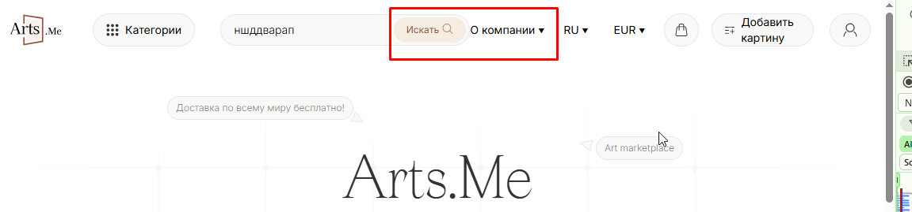

### Отчет по тестированию:
1. Проверено https://tst.arts.me/
2. Под пользователем: в неавторизованной зоне , alexandrashel@list.ru / Aa123123; askolesnikova@bk.ru / 12341234
3. Проверено в: браузере Chrome Версия: 141.0.7390.123
4. Проверено:

### Главная страница
- Загрузка главной страницы при переходе по ссылке https://tst.arts.me/ 
- Корректное добавление товара в корзину при клике Купить
- Всплывающее окно Корзина, корректное отображение элементов ❌
|при ширине окна до 1280рх окно прилипает к краю экрана, позиции и кнопки смещаются
  
- Редирект на страницу оформления товара при клике Перейти к оформлению
- Корректный возврат на главную страницу при клике на Продолжить выбор картин
- Повторный клик на кнопку Купить на товар который уже есть в корзине
- При скролле вниз автоматическая подгрузка нового контента (эндпоинт https://api.tst.arts.me/art-works)
- При скролле вниз до конца контента не возникает ошибок
- Сортировка контента работает корректно
- Фильтрация контента работает корректно (одновременная работа нескольких фильтров, применение одного фильтра, применение фильтрации без отмеченных значений фильтров приводит к получению всех результатов, корректная работа кнопки сброса)
- Совместная работа фильтрации и сортировка корректна
- Корректная работа поиска (при вводе ключевого слова поиска после существующего поиска и клике на Enter окно с подсказками не пропадает)
- Корректная работа всплывающего окна для связи, корректный переход во все соц.сети (окно для связи закрывается только при клике на значок, лучше добавить возможность закрытия окна при клике за его пределы)
- Корректный переход к соц.сетям whatsapp и instagram

### Хедер  
- При скроле вниз страницы всегда остается закреплен наверху, не съезжает при скролле
- При клике на корзину переход к корзине, при наличии в ней товаров на значке отображается метка с количеством товаров в корзине
- При клике на лого переход на главную страницу
- При клике на категории всплывающее меню навигации (меню навигации закрывается только при клике на кнопку Категории, лучше добавить закрытие навигации при клике за пределы меню)
- При выборе категории сортировка картин в указанной категории ❌
после загрузки страницы в любой из категорий после получения ендпоинта https://api.tst.arts.me/art-works/compilation/forlivingroom? 
со страницы пропадают все товары

- Корректная работа поиска (при вводе ключевого слова поиска после существующего поиска и клике на Enter окно с подсказками не пропадает)
- О компании, корректный переход по всем ссылкам: Наши Услуги, О нас, Контакты, Ограничение ответственности, Условия использования, Политика конфиденциальности ❌
блоки слишком близко расположены друг другу при ширине окна до 1410px

- Переключение языка (работа переключения, локализация на главной странице на всех трех языках) ❌
На немецком языке не переведено слово Художников
 
- Валюта,  корректное переключение на все виды валют, отображение цен под картинами в выбранной валюте
- При переключении на CHF (швейцарский франк) страница падает, не загружается при обновлении, восстановить можно только очисткой кук ❌
- При клике на Добавить картину всплывающее окно о необходимости заполнения профиля, в неавторизованной зоне при клике на Заполнить профиль переход к странице авторизации/регистрации, в авторизованной зоне при клике на  Заполнить профиль переход к странице заполнения профиля
- При клике на Войти переход к странице авторизации/регистрации

### Регистрация
- Корректное прохождение пути регистрации с валидными данными
после успешного прохождения регистрации после ввода кода с почты окно для ввода кода не закрывается и никак не сообщает об успехе регистрации и авторизации, закрыть его можно только нажав на крестик ❌
- Валидация на обязательность заполнения полей
- Обязательность заполнения чек-бокса согласия с условиями оферты
- Проверка заполнения поля e-mail (корректный ответ на почту, уже зарегистрированную на сайте; проверка на полноту заполнения почты по примеру example@example.example)
- При попытке регистрации с несуществующей почты появится “Ошибка отправки письма”
- При повторной попытке регистрации ответ изменится на “Данный Email уже зарегистрирован” ❌
- Проверка заполнения поля Пароль (не важно какие символы, главное что пароль должен содержать 8 или более символов)
- Проверка отображения пароля (Ввести пароль, нажать иконку глаза, пользователь увидит введенный пароль)
- Проверка заполнения поля Имя (нет ограничения на символы или их количество, главное не менее 1, нельзя ввести один пробел)
- Проверка заполнения поля Фамилия (нет ограничения на символы или их количество, главное не менее 1, нельзя ввести один пробел)
- Регистрация через соц.сети успешная, не требует подтверждения по почте, после регистрации пользователь попадает в авторизованную зону

### Авторизация
- Авторизация с валидными данными для входа проходит успешно
после успешной авторизации в авторизованной зоне кнопка Войти должна изменится на кнопку Профиль, должно быть выпадающее меню при клике на кнопку Профиль  ❌
- Валидация на обязательность заполнения полей
- Проверка отображения пароля (Ввести пароль, нажать иконку глаза, пользователь увидит введенный пароль)
- Авторизация с невалидными данными/незарегистрированной почтой ❌
авторизация не происходит, информация об ошибке не выделена красным, не бросается в глаза, пользователь может не увидеть проблему
информация об ошибке не выделена красным

- Проверка работы ссылки "Забыли пароль?" (переход по ссылке, получение письма, ввод кода, изменение пароля, авторизация с новыми данными корректная, авторизация со старым паролем не проходит)

### 5. Результат проверки: 
1. Главная страница - работа поиска (при вводе ключевого слова поиска после существующего поиска и клике на Enter окно с подсказками не пропадает)
https://drive.google.com/file/d/1NPsJdBAGdamcDk6EudPIbtfn9qhWakj6/view?usp=sharing 

[Баг-репорт](https://github.com/AlexandraKol/-ru_manual_testing_QA/blob/main/Bug%20reports/Bug%20report_1.md)

2. Главная страница - Фильтр - при выборе фильтра и нажатии на кнопку Сброс чекбоксы не обнуляются
https://drive.google.com/file/d/1qxAEe__3oiNLOSmny-sb9tuNV9-yubxT/view?usp=sharing 

[Баг-репорт](https://github.com/AlexandraKol/-ru_manual_testing_QA/blob/main/Bug%20reports/Bug%20report_2.md)

3. Добавление товара в корзину - всплывающее окно Корзина, корректное отображение элементов
при ширине окна до 1280рх окно прилипает к краю экрана, позиции и кнопки смещаются
  

[Баг-репорт](https://github.com/AlexandraKol/-ru_manual_testing_QA/blob/main/Bug%20reports/Bug%20report_3.md) 

4. Хедер главной страницы - Переключение языка 
На немецком языке не переведено слово Художников
 

[Баг-репорт](https://github.com/AlexandraKol/-ru_manual_testing_QA/blob/main/Bug%20reports/Bug%20report_4.md)

5. Хедер главной страницы - Валюта - 
при переключении на CHF (швейцарский франк) страница падает, не загружается при обновлении, восстановить можно только очисткой кук
https://drive.google.com/file/d/1FwlAQzVedpA8OQ4u0OsTxi9dLSOtleUF/view?usp=sharing 

[Баг-репорт](https://github.com/AlexandraKol/-ru_manual_testing_QA/blob/main/Bug%20reports/Bug%20report_5.md) 

6. Хедер главной страницы - Категории - после загрузки страницы в любой из категорий после получения ендпоинта https://api.tst.arts.me/art-works/compilation/{}  со страницы пропадают все товары

[Баг-репорт](https://github.com/AlexandraKol/-ru_manual_testing_QA/blob/main/Bug%20reports/Bug%20report_6.md)

7. Регистрация - При попытке регистрации с несуществующей почты появится “Ошибка отправки письма”, при повторной попытке регистрации ответ изменится на “Данный Email уже зарегистрирован” 
https://drive.google.com/file/d/1p5EB5QuH_CTuxBvd0YQKbRKvkXKUDxho/view?usp=sharing

[Баг-репорт](https://github.com/AlexandraKol/-ru_manual_testing_QA/blob/main/Bug%20reports/Bug%20report_7.md)

8. Регистрация - после успешного прохождения регистрации после ввода кода с почты окно для ввода кода не закрывается и никак не сообщает об успехе регистрации и авторизации, закрыть его можно только нажав на крестик
https://drive.google.com/file/d/1wlbDTZgSVdtKnyVUzuPn3yknqNiHk71i/view?usp=sharing 

[Баг-репорт](https://github.com/AlexandraKol/-ru_manual_testing_QA/blob/main/Bug%20reports/Bug%20report_8.md)

9. Авторизация - после успешной авторизации в авторизованной зоне кнопка Войти должна изменится на кнопку Профиль, должно быть выпадающее меню при клике на кнопку Профиль  

[Баг-репорт]([https://github.com/AlexandraKol/-ru_manual_testing_QA/blob/main/Bug%20report.md](https://github.com/AlexandraKol/-ru_manual_testing_QA/blob/main/Bug%20reports/Bug%20report_9.md)

10. Авторизация с невалидными данными/незарегистрированной почтой
авторизация не происходит, информация об ошибке не выделена красным, не бросается в глаза, пользователь может не увидеть проблему

[Баг-репорт]([https://github.com/AlexandraKol/-ru_manual_testing_QA/blob/main/Bug%20report.md](https://github.com/AlexandraKol/-ru_manual_testing_QA/blob/main/Bug%20reports/Bug%20report_10.md)

### 6. Рекомендации по улучшению:
- Хедер главной страницы - Категории - меню навигации закрывается только при клике на кнопку Категории, лучше добавить закрытие навигации при клике за пределы меню
- Хедер главной страницы - О компании- блоки слишком близко расположены друг другу при ширине окна до 1410px
- Главная страница - Всплывающее окно для связи - окно для связи закрывается только при клике на значок, лучше добавить возможность закрытия окна при клике за его пределы
